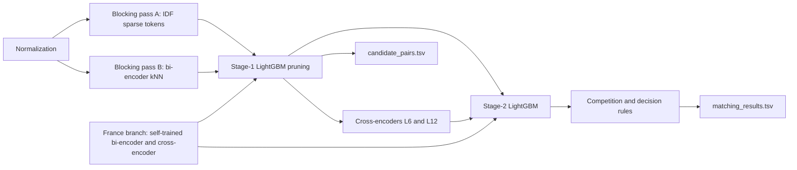
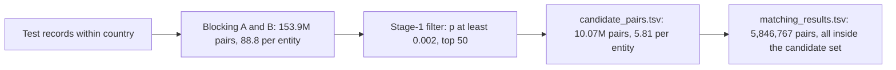

# ML Challenge 2026: Business Entity Resolution Solution

**Team Name:** [Your Team Name]  
**Team Leader:** Sumantha  
**Team Members:** Syed Ayaan, Shreyas S, Sharan Malali  
**Institution:** BMS College of Engineering  
**Submission Date:** 27 September 2026

---

## 1. Executive Summary
Source-2/Source-3 records are linked to Source-1 entities in four steps: normalization, candidate generation
(two-pass blocking within country followed by a LightGBM pruning filter), scoring (a second LightGBM stage with
within-entity context and two fine-tuned MiniLM cross-encoders), and a one-to-many decision in which each record keeps
at most one Source-1 entity. The candidate set holds **5.81 candidates per Source-1 entity** (10.07M pairs, 15x fewer
than blocking proposes) and contains 100% of the final matches.

France is absent from the training data. Its gap was traced to the embedding features, which transfer the India/US
domain, and closed without labels: self-trained France bi-encoder and cross-encoder, and a label-free **count
signature** that estimates the true-match share of any set of test pairs and was used to measure every late change.
Public leaderboard: 0.967016 (first submission) -> **0.989334** (final submission 16).

---

## 2. Methodology

### 2.1 Problem Analysis
* Source 1 is deduplicated and each S2/S3 record belongs to at most one Source-1 entity (100% of train labels).
  Matches per Source-1 entity follow one distribution in every country (mean 3.46; 5.6% have none), and about 40% of
  test S2/S3 records have no Source-1 entity (distractors).
* Name noise: typos, accents, leetspeak, added or dropped legal forms, replaced generic words, acronyms, domains,
  "aka/DBA" names, unrelated brand names at the same address, and native-script names in 9 Indic scripts.
  Address noise: abbreviations, reordering, missing parts, NULL literals, altered house numbers, city variants.
* Hard negatives are "twins": another business with a near-identical name, often at a nearby address.
* France (15% of test) is absent from training. Its 259k Source-1 entities sit in 15 cities, so near-identical names
  share streets: 12.7% of France entities share their exact core name with at least 10 entities of the same city
  (India 0.7%, US 0%).

### 2.2 Solution Strategy
**Approach Type:** blocking and learned candidate pruning, two-stage gradient-boosted matcher with cross-encoder
features, one-to-many decision rules, and label-free test-time adaptation for the unseen country.  
**Core Innovation:** (1) a small candidate set without recall loss: stage 1 is used as a pruning filter, so the
expensive models score 5.81 pairs per entity; (2) France adaptation by self-training on near-certain French pairs
with near-twin negatives and rehearsal; (3) the count signature, which measures precision on the unlabelled test set
and replaced leaderboard probing for France decisions.

---

## 3. Candidate Generation (Blocking)
- **Blocking keys used:** country (it agrees for 100% of true pairs), then two passes whose union is the proposal set.
  Pass A: typed tokens (name tokens, 4-character prefixes, concatenated name, address words, numbers), IDF-weighted
  with document frequency capped at 5000, L2-normalized sparse cosine; top 30 records per entity plus the top 8
  entities per record (reverse direction). Pass B: MiniLM-L6 bi-encoder (Apache-2.0) fine-tuned with in-batch InfoNCE
  on train pairs, exact GPU top 20 forward plus top 5 reverse. Blocking proposes **88.8 records per entity**
  (153.9M test pairs). Then a **LightGBM pruning filter** (stage 1) scores every proposal from cheap pairwise
  features (string, token, number, blocking rank and bi-encoder similarities) and keeps pairs with probability at
  least 0.002, at most 50 per entity (`src/candidate_set.py`).
- **Candidate pairs generated:** **10.07M pairs, 5.81 per Source-1 entity**, a 15x reduction; 11,171 entities have
  an empty list. This is the file `output/candidate_pairs.tsv`, and the cross-encoders and stage 2 score only this set.
- **How you ensured true matches were not lost:** bidirectional retrieval (the reverse direction uses "each record
  has one owner"), a lexical and a semantic pass (validation blocking recall 0.9956), and a pruning cutoff two orders
  of magnitude below the decision thresholds (0.5 to 0.8). All 5,846,767 final matched pairs lie inside the set.
  Pass A's work per query is bounded (fixed top-k, document-frequency cap). Pass B uses exact kNN, which fits this
  data size; at billions of records an approximate index (for example HNSW) would take its place.

---

## 4. Matching Model

**Features used:**
- Name: ratio, token-sort, token-set, partial and WRatio, Jaro-Winkler and Levenshtein on concatenated names,
  IDF-weighted token coverage, alternative (DBA) names, legal-form agreement or conflict, exact and core equality,
  name ambiguity (how many entities share the name), and "twin" edit features (missing, extra or substituted tokens,
  token order, legal-form relation).
- Address: token-set similarity, street-token overlap, house-number equality, edit distance and prefix relation,
  state agreement, missing components, neighbourhood density (same-city same-name entity counts, same-street count).
- Other: blocking ranks and scores, bi-encoder cosine; competition features (rank and gap of a pair among all
  entities of the same record and all records of the same entity); stage-2 entity context (best, sum and rank of the
  entity's stage-1 scores, similarity to its confident sibling records); two cross-encoder scores with rank and gap.

**Model type:** LightGBM stage 1 (about 74 features, trained on train entities); MiniLM-L6 and MiniLM-L12
cross-encoders fine-tuned on 6M and 11.9M train pairs; LightGBM stage 2 trained out-of-fold on validation entities
with the cross-encoder scores as features.  
**Threshold selection method:** macro F0.5 on a validation set of disjoint entities. Each record keeps only its best
entity; candidate competition p_i <- o_i / (1 + w * sum_j o_j), o = p / (1 - p), enforces the one-owner rule.
India/US: threshold 0.5 and w = 2, chosen on a test-like validation (below). France: threshold 0.8, chosen from
leaderboard evidence because France has no labels.

**France adaptation (no labels, no external data):**
1. Diagnosis: 77% of stage-1 gain comes from two bi-encoder features, and on obvious French matches their values sit
   2.2 standard deviations from India/US; an exclusivity excess (probability mass above the one-owner limit) showed
   France 10 to 35 times more overconfident than India/US.
2. Bi-encoder self-trained on 0.7 to 0.8M near-certain French pairs, batches sorted by (city, name) so in-batch
   negatives are near-twins; feature IDF on the training scale.
3. Cross-encoder self-trained with near-twin negatives and 2M rehearsed train pairs (India/US calibration kept);
   the final France score averages the original and the self-trained variant.
4. Vocabulary-swap filter: a record whose core name differs by one ordinary Source-1 vocabulary word (club, ecole)
   rather than a generator noise word (fils, services) is a different business; 26,942 pairs removed.

**Count signature (precision on the unlabelled test):** for a pair (entity s, record from source X), r = the number
of s's other selected X matches divided by its other-source matches. Records generated from s give r of about 0.75
(S2) and 0.88 (S3), the values of labelled validation true pairs; unrelated records give 0.94 and 1.07. The true
share of a pair set is (U - r) / (U - T). The corrections of submissions 12 to 16 were kept only when this estimate
(and, for India/US, validation labels) put them clearly on one side of the F0.5 break-even (about 0.77 true).

**Validation design:** the test's no-address rates (2.3 to 2.9%, against 3.8 to 4.9% for matched and 0.2 to 0.3%
for unmatched train records) show that its extra records are distractors, not records of absent entities. The
"ghost" validation (20% of entities removed) was replaced by a test-like one, and stage 2 was refit without
ghost-owned rows.

---

## 5. Results & Error Analysis

- **F_0.5 Score (macro):** validation (India/US) 0.9897 (P 0.9975, R 0.9737); test-like validation 0.9914;
  **public leaderboard 0.989334** (submission 16, best of all submissions).

| # | Change | Public F0.5 |
|---|---|---|
| 1 | Blocking A and B, stage-1 LightGBM | 0.967016 |
| 2 | Stage 2 with MiniLM-L6 cross-encoder | 0.979034 |
| 3 | Name-ambiguity and twin features | 0.981132 |
| 6 | Candidate competition, France threshold 0.85 | 0.982487 |
| 8 | France self-trained bi-encoder and cross-encoder | 0.984816 |
| 10 | Vocabulary-swap filter, France recall recovery, no-ghost stage 2 | 0.988833 |
| 12 | Count-signature corrections (D-024) | 0.988865 |
| 13 | Contested India/US pairs removed, France acronyms added | 0.988978 |
| 16 | Stage-3 additions, legal-form conflicts, France noise-word swaps, low-label cells | **0.989334** |

- **Common false positives (wrong merges):** in France, same-address businesses whose names differ by one ordinary
  word; elsewhere, twins with a nearby house number, and no-address records whose name several entities share.
- **Common false negatives (missed matches):** records without an address whose name is shared by several entities
  (69% of validation misses have an empty address), unrelated brand names, blocking misses (0.44% of true pairs).

---

## 6. Conclusion
Language-agnostic similarity and competition features with a context-aware second stage reach 0.99 on the training
countries, and a learned pruning filter keeps the candidate set at 5.81 pairs per entity without losing a final
match. The main lesson came from the unseen country: learned embeddings carry their training domain, and label-free
diagnostics (exclusivity violations, feature shift on obvious pairs, the count signature) located the failure and
measured the fixes on the test set itself.

---

## Appendix

### A. Code Artefacts
`code/business_entity_resolution/` (README.md with run commands, requirements.txt, src/). Entry points in order:
`learn_dict.py`, `preprocess.py`, `run_blocking.py`, `embed.py finetune|knn`, `candidates.py`, `train.py`,
`predict.py`, `crossenc.py pairs|train|score`, `stage2.py fit|apply`; France: `france_adapt.py`,
`embed.py finetune_pseudo`, `crossenc.py train_pseudo`; decision and corrections: `france_adapt.py assemble`
(`vswap.py`, `refine.py`, `testlike.py`) and `apply_corrections.py` with `corrections/corrections.tsv`
(D-025 to D-030); candidate file: `candidate_set.py`. Design: `docs/ARCHITECTURE.md`; decision log with measured
effects: `docs/DECISIONS.md` (D-001 to D-030); experiments and submissions: `docs/SUBMISSIONS.md`.

### B. Additional Results
Two leaderboard regressions shaped the method: 0.984582 (France text fixes let more vocabulary swaps through, which
led to the swap filter) and 0.988556 (a first-match rule and a lower threshold chosen on validation did not transfer
to low-probability pairs). A multilingual XLM-R reranker (bge-reranker-base) added only +0.00003 to +0.00007 on
validation and failed the count signature on test, so it was not used (D-029).
