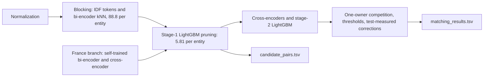

# Amazon ML Challenge 2026: business entity resolution

Links Source-2 and Source-3 business records to deduplicated Source-1 reference entities. An entity can have many
matching records or none; each record has at most one owner. The metric is macro F0.5 over Source-1 entities.

**Result:** public leaderboard 0.989334 (final submission 16). The candidate set holds 5.81 candidates per Source-1
entity, and every final match lies inside it.

## Approach

1. **Normalization** of names and addresses: legal forms, abbreviations, house numbers, a learned token dictionary
   and transliteration for 9 Indic scripts.
2. **Candidate generation** within country: IDF-weighted sparse token overlap (pass A) and a fine-tuned MiniLM
   bi-encoder with exact GPU kNN (pass B) propose 88.8 records per entity (153.9M test pairs). The stage-1 LightGBM
   then keeps pairs with probability at least 0.002, at most 50 per entity: 10.07M pairs, 5.81 per entity, a 15x
   reduction that keeps 100% of the 5,846,767 final matched pairs.
3. **Scoring:** two fine-tuned MiniLM cross-encoders and a stage-2 LightGBM with entity context, sibling similarity,
   name-ambiguity, twin and density features.
4. **Decision:** each record keeps its best entity, candidate competition enforces the one-owner rule, then
   per-country thresholds.
5. **France**, absent from training: bi-encoder and cross-encoder self-trained on near-certain French pairs with
   near-twin negatives, a vocabulary-swap filter, and a label-free count signature that measures the true-match share
   of any set of test pairs.

## Repository layout
| Path | Content |
|---|---|
| `code/business_entity_resolution/` | Pipeline code, `requirements.txt`, run instructions (`README.md`) |
| `docs/ARCHITECTURE.md` | Pipeline diagrams, candidate funnel, stage descriptions, module map |
| `docs/DECISIONS.md` | Decision log D-001 to D-030 with measured effects |
| `docs/SUBMISSIONS.md` | Every experiment and leaderboard submission with its commit |
| `docs/EDA.md`, `docs/RESEARCH.md` | Data findings and literature notes |
| `Documentation_template.md` | Two-page approach document for the submission |
| `student_resource/` | Dataset and the official validator (not in git) |
| `artifacts/`, `output/` | Intermediate files and submission files (not in git) |

## Reproducing
Environment, data layout and the full command sequence, including how to regenerate `candidate_pairs.tsv`
(`candidate_set.py`) and `matching_results.tsv` (`france_adapt.py assemble` and the correction scripts), are in
`code/business_entity_resolution/README.md`.
