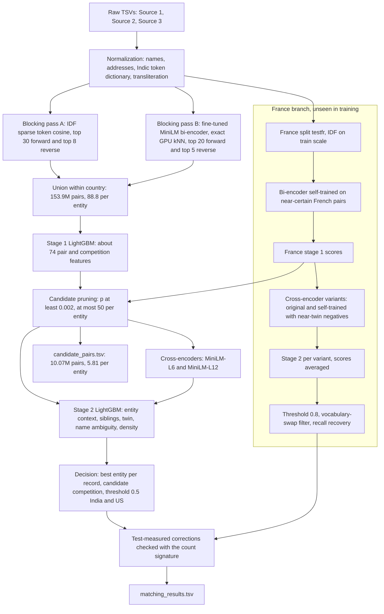
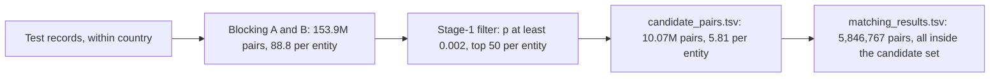

# Architecture

The pipeline links Source-2 and Source-3 business records to deduplicated Source-1 entities. Each record has at most
one owner; an entity can have many records or none. All stages run within a country, because the country agrees for
every true pair. Decision numbers (D-xxx) are listed in the decision-label table at the end of this document, which names each
choice.

## End-to-end flow

## Candidate funnel

Amazon's final evaluation reviews `candidate_pairs.tsv` and ranks a smaller candidate set per Source-1 entity
higher. Candidate generation therefore has two steps: blocking for recall, then a learned filter for size.

| Step | Pairs on test | Per entity | What it keeps |
|---|---|---|---|
| Blocking pass A and pass B (union) | 153.9M | 88.8 | validation blocking recall 0.9956 |
| Stage-1 pruning filter | 10.07M | 5.81 | 100% of the 5,846,767 final matched pairs |

* The filter is the stage-1 LightGBM (`train.py`), applied to cheap pairwise features computed on every proposal.
  Its cutoff (0.002) is far below the decision thresholds (0.5 India/US, 0.8 France), so pruning removes pairs
  the later stages would never select.
* French entities use the stage-1 scores of the adapted France pipeline (split `testfr`) instead of the full-test
  scores.
* 11,171 entities have an empty candidate list.
* The cross-encoders and stage 2 score only this set, so every match is a candidate by construction.
* `candidate_set.py` writes the file: one row per test Source-1 entity, candidates ordered by stage-1 score.

## Stages

### 1. Normalization (`preprocess.py`, `normalize.py`, `learn_dict.py`, `translit.py`)
Names: legal forms, junk tokens, leetspeak, "dba/t-a" names, website names. Addresses: street types (English, French,
Indian), states, house numbers, NULL literals. Native-script tokens are mapped by a token dictionary learned from
train pairs, with rule transliteration for 9 Indic scripts as the fallback. `learn_dict.py` must run first because
the normalizer loads its output.

### 2. Blocking (`blocking.py`, `run_blocking.py`, `embed.py`, `candidates.py`)
* Pass A: typed tokens (name tokens, 4-character prefixes, concatenated name, address words, numbers), IDF-weighted,
  tokens with document frequency above 5000 dropped, L2-normalized sparse cosine, chunked sparse products.
  Top 30 records per entity and top 8 entities per record.
* Pass B: `sentence-transformers/all-MiniLM-L6-v2` fine-tuned with in-batch InfoNCE on train pairs; exact GPU kNN,
  top 20 forward and top 5 reverse.
* `candidates.py` merges both passes and attaches the bi-encoder cosine to every pair.

### 3. Stage 1 (`features.py`, `store.py`, `train.py`, `predict.py`)
About 74 features: rapidfuzz name similarities, IDF token coverage, legal-form relation, house-number and street
relations, state agreement, blocking ranks and scores, bi-encoder cosine and ranks, and competition features (rank
and gap of a pair among all entities of the same record and all records of the same entity). Features are written
to a resumable sharded store. LightGBM is trained on train entities; validation uses disjoint entities.

### 4. Cross-encoders (`crossenc.py`, `run_ce.sh`, `run_ce2.sh`)
MiniLM-L6 and MiniLM-L12 cross-encoders fine-tuned on 6M and 11.9M train pairs, applied to the pruned candidates.
Their scores, ranks and gaps are stage-2 features.

### 5. Stage 2 (`stage2.py`, `twin.py`, `geo.py`, `pairtype.py`)
LightGBM trained out-of-fold on validation stage-1 scores. Flags select feature groups: `--ce`, `--ce2 <tag>`
(cross-encoders), `--x` (name ambiguity and twin edit features), `--dens` (neighbourhood density and pair types),
`--noghost` (fit without rows owned by ghost entities, D-020).

### 6. Decision (`decide.py`, `france_adapt.py assemble`)
Each record keeps only its best entity. Candidate competition rescales p_i to o_i / (1 + w * sum_j o_j) with
o = p / (1 - p) over the other entities of the same record. India/US: threshold 0.5, w = 2 (test-like validation,
`testlike.py`). France: threshold 0.8 (leaderboard evidence), then `vswap.py` removes vocabulary swaps (D-021),
`--fr-recover` adds high-precision categories below the threshold (D-022), and `refine.py` applies test-measured
corrections (D-024).

### 7. France adaptation (`france_adapt.py`, D-018 to D-022, D-027, D-028, D-030)
France is absent from training. Stage 1 takes 77% of its gain from two bi-encoder features, and the India/US
bi-encoder packs French businesses together. The France branch re-runs the embedding stages on split `testfr`:
bi-encoder self-trained on near-certain French pairs with near-twin in-batch negatives, IDF at train scale,
cross-encoder self-trained with near-twin negatives and rehearsal on 2M labelled pairs, and an average of the
original and the self-trained cross-encoder variants.

### 8. Count signature and late corrections (`refine.py`, `apply_corrections.py`)
For a pair (entity s, record from source X), r = s's other selected X matches divided by its other-source matches.
Records generated from s give r of about 0.75 (S2) and 0.88 (S3); unrelated records give 0.94 and 1.07. The true share
of a pair set is (U - r) / (U - T). Submissions 12 to 16 apply corrections whose estimated share lies clearly on one
side of the F0.5 break-even (D-024 to D-030).

## Code layout (`code/business_entity_resolution/src/`)
| File | Role |
|---|---|
| `config.py` | Paths (overridable: `BER_DATA`, `BER_ARTIFACTS`, `BER_FEATS`, `BER_OUTPUT`), worker count, seed |
| `data.py` | Loading helpers for normalized sources and ground truth |
| `learn_dict.py`, `translit.py`, `normalize.py`, `preprocess.py` | Normalization |
| `blocking.py`, `run_blocking.py` | Pass A blocking and recall report |
| `embed.py` | Bi-encoder fine-tuning (`finetune`, `finetune_pseudo`) and exact GPU kNN (`knn`) |
| `candidates.py` | Merge of pass A and pass B |
| `features.py`, `store.py` | Pair and competition features, resumable sharded store |
| `train.py`, `predict.py` | Stage-1 LightGBM training and test scoring |
| `candidate_set.py` | Pruned candidate set, writes `candidate_pairs.tsv` |
| `crossenc.py` | Cross-encoder pairs, training, self-training, scoring |
| `twin.py`, `geo.py`, `pairtype.py` | Twin edit features, city extraction for density, discrete pair types |
| `stage2.py` | Stage-2 LightGBM fit and apply |
| `decide.py`, `metrics.py`, `testlike.py` | Decision rules, macro F0.5, test-like validation |
| `france_adapt.py`, `vswap.py`, `refine.py` | France pipeline, vocabulary-swap filter, test-measured corrections |
| `country_mix.py`, `blend_country.py` | Per-country score or submission blending (D-015, D-016) |
| `apply_corrections.py` | Replays the recorded test-set corrections (`corrections/corrections.tsv`, D-025 to D-030) on the assembled file |

## Scale notes
* 27M records are normalized in about 6 minutes on 32 processes.
* Pass A uses sparse matrix products chunked over worker processes; the document-frequency cap bounds the work per
  query. Pass B is exact kNN on the GPU, which fits this data size; at larger scale an approximate index would replace it.
* Features run at about 47 microseconds per pair per process. Every long step checkpoints to disk and resumes after
  a crash.
* The expensive models (cross-encoders, stage 2) see 5.81 pairs per entity instead of 88.8.

## Decision labels

Comments in the code and the documents refer to design decisions by label. Each label names one change that was measured before it was kept.

| Label | Decision |
|---|---|
| D-001 | Python environment: anaconda3 + CUDA torch |
| D-002 | Block within country |
| D-003 | Normalization is rule-based domain knowledge, no external data |
| D-004 | One transliterator for all Indic scripts |
| D-005 | Blocking v1 = IDF-weighted sparse token retrieval in both directions |
| D-006 | One-to-many assignment + expected-F0.5 decision |
| D-007 | Validation mimics the test distractor rate ("ghost" S1s) |
| D-008 | Learned native-token dictionary beats rule transliteration |
| D-009 | Blocking pass B: fine-tuned MiniLM bi-encoder + exact GPU top-k |
| D-010 | Features computed for all non-ghost S1s |
| D-011 | Pairs held as int32 row positions; feature tables on a separate drive |
| D-012 | Resumable, sharded feature store |
| D-013 | Stage-2 name-ambiguity and twin features |
| D-014 | France: bogus state codes from French words, left unfixed |
| D-015 | Per-country blend of submissions |
| D-016 | France threshold probes on the leaderboard |
| D-017 | France overconfidence comes from the cross-encoders; candidate competition |
| D-018 | France: covariate shift in the bi-encoder features; France-only pipeline with an adapted encoder |
| D-019 | France text normalization fixes |
| D-020 | The ghost validation (D-007) does not match the test; test-like validation |
| D-021 | France "vocabulary swaps" are false matches |
| D-022 | Label-free calibration on the test set with the count signature |
| D-023 | First-match rule for S1s without predictions |
| D-024 | Final small corrections, all measured on the test set |
| D-025 | Extra last submission: contested marginal India/US pairs, France acronym leftovers |
| D-026 | Stage-3 correction model and France contested pairs |
| D-027 | Coverage check vs the generator; legal-form removals and France no-house-number additions |
| D-028 | Final error analysis in three areas with independent re-checks; France noise-word descriptor swaps |
| D-029 | Bigger multilingual cross-encoder and the last France pools: negative |
| D-030 | Last round: France descriptor-swap decoys (removed) and India/US low-label cells p 0.5-0.6 |
